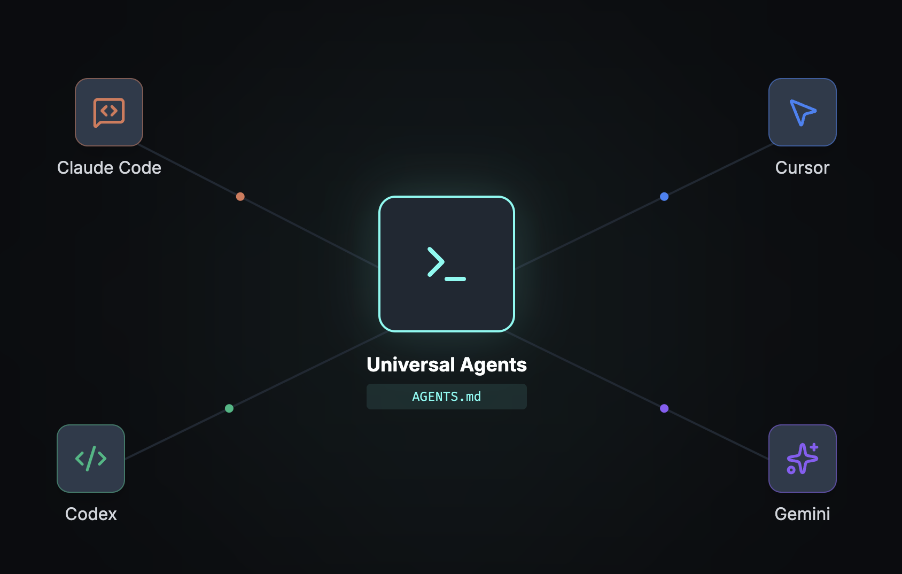

# Universal Agents

A lightweight standard for sharing agent configurations across all AI coding assistants using a single `AGENTS.md` file.



## Quick Start

Run the CLI via npx:

```bash
npx universal-agents init           # copy AGENTS.md into your project
npx universal-agents create skill   # scaffold .agents/skills/<name>/SKILL.md
npx universal-agents create rule    # scaffold .agents/rules/<name>.md
```

### Apply Universal Agents in Claude Code

Claude Code sometimes ignores its `CLAUDE.md` file and doesn't support the `AGENTS.md` protocol. Use a user memory prompt to force loading:

```
ALWAYS read AGENTS.md file first
```

In Claude, pin this via the `/memory` command so it stays in user memory.

## Why Universal Agents?

Different AI coding assistants use different conventions to organize their configuration files. For example:

- Claude Code stores skills in `.claude/skills/<skill-name>/SKILL.md`
- Cursor stores rules in the `.cursor/rules/` folder

This fragmentation locks configurations into single platforms. Teams cannot share context and workflow definitions across tools.

## The Solution

Universal Agents provides the **lightest, simplest** shared standard: `AGENTS.md` + `.agents/` folder. Any agent—regardless of runtime—reads this one manifest to bootstrap rules and skills.

## How it works

Universal Agents uses a single entry point—`AGENTS.md`—to describe which skills and rules apply to any task. All skills and rules live in `.agents/` for version control and easy sharing.

| File/Folder       | Purpose                                                                                                       |
| ----------------- | ------------------------------------------------------------------------------------------------------------- |
| `AGENTS.md`       | Control manifest listing all available skills and rules, with trigger conditions and loading instructions.    |
| `.agents/skills/` | Reusable task workflows (e.g., code review, testing) — each skill is self-contained and production-ready.     |
| `.agents/rules/`  | Domain guidelines (e.g., API design, React conventions) — long-lived constraints that enforce team standards. |

## Key advantages

- **One source of truth**: `AGENTS.md` works across Claude Code, Cursor, Codex, and any future AI assistant.
- **Zero boilerplate**: No tool-specific file structure. Just read `AGENTS.md`, follow its protocol.
- **Minimal footprint**: Lightweight Markdown—no DSLs, config files, or complex tooling required.
- **Immediate adoption**: Agents that understand the `AGENTS.md` protocol can bootstrap any project instantly.

## Execution protocol

1. **Read `AGENTS.md` first** to discover available skills and rules, plus their trigger conditions.
2. **Load skills on demand**: when a task matches a skill's trigger, read the skill file and follow its workflow.
3. **Enforce rules whenever relevant**: if a task touches governed domains, preload and apply the matching rule file.
4. **Declare applied guardrails**: list which skills and rules were active so transparency is guaranteed.

## Visual references

| Asset   | Codex                              | Claude code                                 |
| ------- | ---------------------------------- | ------------------------------------------- |
| Preview |  |  |

## Rules vs. skills in plain language

| Aspect           | Rules (Cursor-style)                                                               | Skills (Claude-style)                                                                                            |
| ---------------- | ---------------------------------------------------------------------------------- | ---------------------------------------------------------------------------------------------------------------- |
| Content type     | Textual guardrails (e.g., “use `python-docx`, add a title, keep formatting tidy”). | End-to-end package with docs, runnable templates, and tooling (often sourced from `/mnt/skills/.../SKILL.md`).   |
| Execution effort | Agent interprets and implements instructions manually.                             | Provides production-tested code snippets, patterns, and edge-case playbooks ready to drop into a task.           |
| Use case         | Keeps behavior aligned with policies and coding standards.                         | Speeds up specialized workflows by handing the agent a toolbox plus demo-quality walkthroughs.                   |
| Maintenance      | Update the prose rule whenever governance changes.                                 | Refresh the skill bundle when better implementations or examples land; the structure makes verification simpler. |

In short:

- Rules are the "manual"
- Skills are the "manual + toolbox + show-and-tell" kit you reach for when the task demands more than guidelines.
