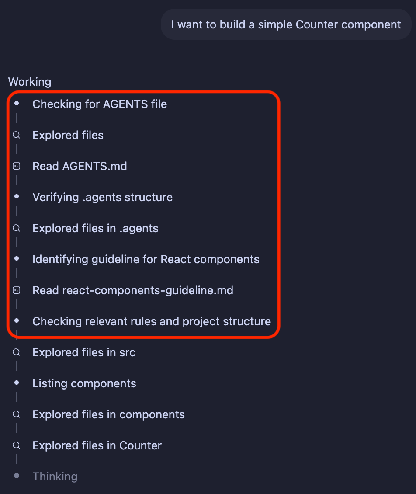
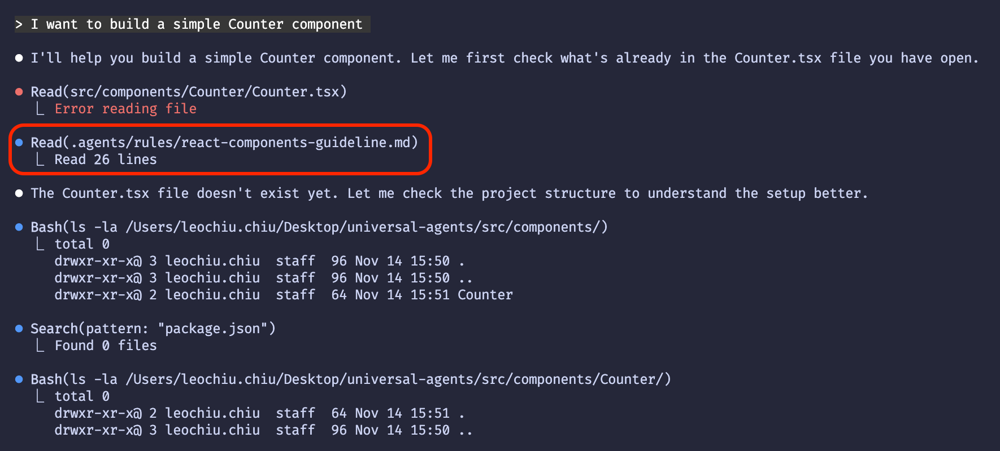

# Universal Agents

This repository hosts the canonical rules and skills every Universal Agent must follow so that behavior stays consistent across runtimes. By mirroring the contents of `.agents/` and `AGENTS.md`, any agent can reboot into a known-good configuration and collaborate with peers safely.

## Quick Start

Run the CLI via npx:

```bash
npx universal-agents init           # copy AGENTS.md into your project
npx universal-agents create skill   # scaffold .agents/skills/<name>/SKILL.md
npx universal-agents create rule    # scaffold .agents/rules/<name>.md
```

### Apply Universal Agents in Claude Code

Claude Code sometimes ignores its `CLAUDE.md` file and doesn't support the `AGENTS.md` protocol. Use a user memory prompt to force loading:

```
ALWAYS read AGENTS.md file first
```

In Claude, pin this via the `/memory` command so it stays in user memory.

## Why Universal Agents?

Different AI coding assistants use different conventions to organize their configuration files. For example:

- Claude Code stores skills in `.claude/skills/<skill-name>/SKILL.md`
- Cursor stores rules in the `.cursor/rules/` folder

This fragmentation means agents cannot easily share or reuse configurations from one another.

Universal Agents solves this by providing a unified structure for organizing rules and skills that works across all AI coding assistants.

## Reference layout

| Path             | Purpose                                                                                                           |
| ---------------- | ----------------------------------------------------------------------------------------------------------------- |
| `AGENTS.md`      | Control manifest describing the execution protocol, how to load skills/rules, and the required response contract. |
| `.agents/skills` | Like functions — they let the AI agent execute specific actions.                                                  |
| `.agents/rules`  | Like conventions — they inform the AI agent about the guidelines of the codebase.                                 |

## Execution protocol

1. **Always read `AGENTS.md` first** to understand which skills or rules apply before starting a task.
2. **Load skills on demand**: read `skills/*/SKILL.md` only when its trigger matches the task, then follow the prescribed workflow and output format.
3. **Enforce rules whenever relevant**: if a task touches REST APIs, React components, or Git commits, preload the corresponding `.agents/rules/*.md` file and ensure all advice respects it.
4. **Declare context in responses**: every reply must list which skills and rules were activated so users know which guardrails were applied.

## Visual references

| Asset   | Codex                              | Claude code                                 |
| ------- | ---------------------------------- | ------------------------------------------- |
| Preview |  |  |

Following this structure ensures every Universal Agent bootstraps with the same knowledge base, yielding predictable, rule-compliant collaboration.

## Rules vs. skills in plain language

| Aspect           | Rules (Cursor-style)                                                               | Skills (Claude-style)                                                                                            |
| ---------------- | ---------------------------------------------------------------------------------- | ---------------------------------------------------------------------------------------------------------------- |
| Content type     | Textual guardrails (e.g., “use `python-docx`, add a title, keep formatting tidy”). | End-to-end package with docs, runnable templates, and tooling (often sourced from `/mnt/skills/.../SKILL.md`).   |
| Execution effort | Agent interprets and implements instructions manually.                             | Provides production-tested code snippets, patterns, and edge-case playbooks ready to drop into a task.           |
| Use case         | Keeps behavior aligned with policies and coding standards.                         | Speeds up specialized workflows by handing the agent a toolbox plus demo-quality walkthroughs.                   |
| Maintenance      | Update the prose rule whenever governance changes.                                 | Refresh the skill bundle when better implementations or examples land; the structure makes verification simpler. |

In short:

- Rules are the “manual”
- Skills are the “manual + toolbox + show-and-tell” kit you reach for when the task demands more than guidelines.

## Apply Universal Agents in Claude Code

Claude Code sometimes ignores its `CLAUDE.md` file and doesn't support the `AGENTS.md` protocol. Use a user memory prompt to force loading:

```
ALWAYS read AGENTS.md file first
```

In Claude, pin this via the `/memory` command so it stays in user memory.
